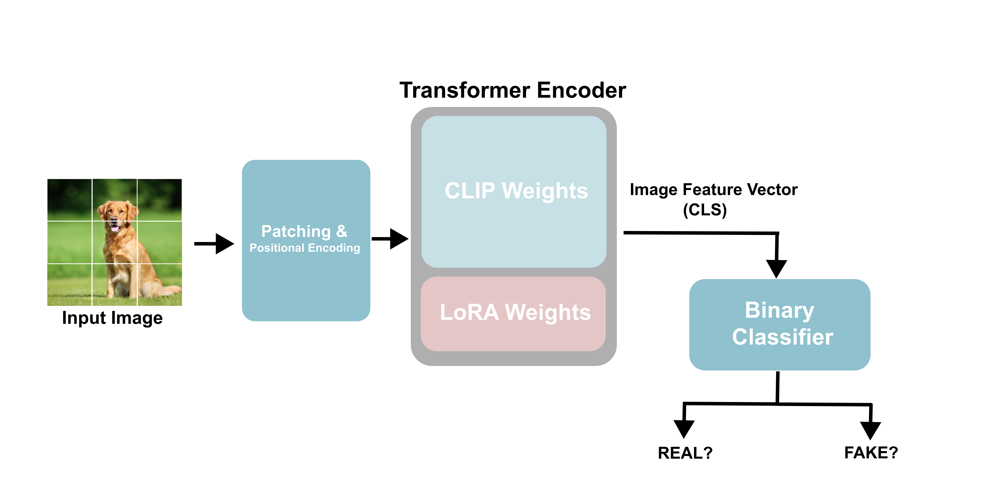

# AI-Image-Detection-Model

A binary classifier vision transformer based binary classifier to distinguish if an image was generated by an AI model or not.

## Problem Overview

With the rapid advancement of generative AI, determining whether something was generated by an AI or not poses a serious concern for users.

## Dataset

We used the **ArtiFact** dataset, which contains 2.5 million images, generated from 25 different models.

## Model Architecture

- **Base Encoder:** OpenAI's CLIP ViT image encoder pre‑trained on internet‑scale data.  
- **Fine‑Tuning with LoRA:**  
  - Freeze original weights  
  - Inject low‑rank adapters into selected transformer layers  
  - Train only ~0.16 % of total parameters for efficiency and to avoid catastrophic forgetting.

